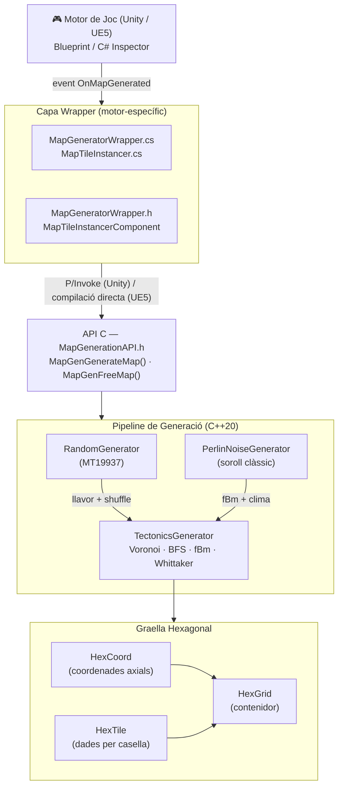
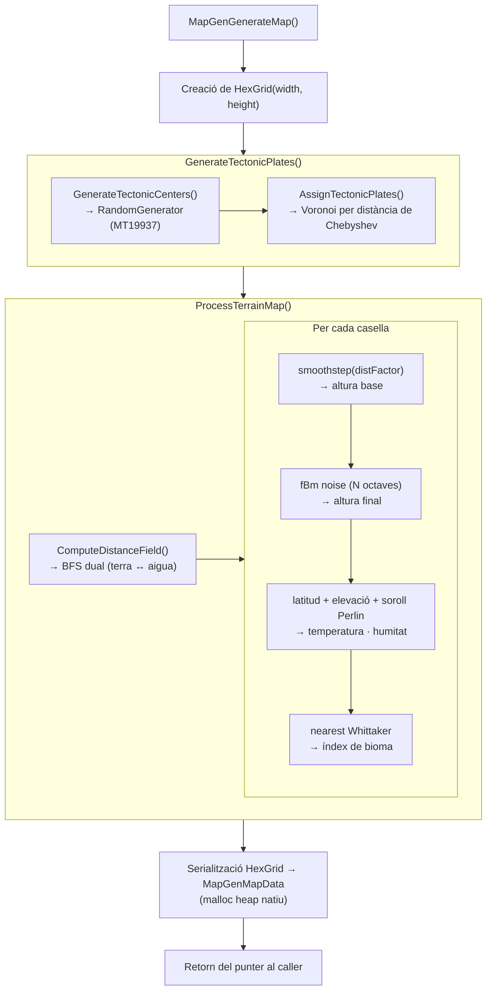

# Manual d'instal·lació i ús
Per llegir el manual d'instal·lació i ús llegir [INSTALL.md](INSTALL.md)

# Documentació del plugin

## Taula de Continguts

1. [Visió General](#1-visió-general)
2. [Arquitectura del Sistema](#2-arquitectura-del-sistema)
3. [Nucli C++: MapGenCore](#3-nucli-c-mapgencore)
   - 3.1 [Sistema de Coordenades Hexagonals](#31-sistema-de-coordenades-hexagonals)
   - 3.2 [Graella Hexagonal](#32-graella-hexagonal)
   - 3.3 [Generadors Procedimentals](#33-generadors-procedimentals)
   - 3.4 [Pipeline de Generació de Mapes](#34-pipeline-de-generació-de-mapes)
   - 3.5 [API Pública C](#35-api-pública-c)
4. [Integració amb Unity](#4-integració-amb-unity)
5. [Integració amb Unreal Engine 5](#5-integració-amb-unreal-engine-5)
6. [Estructures de Dades](#6-estructures-de-dades)
7. [Sistema de Proves](#7-sistema-de-proves)
8. [Compatibilitat Multiplataforma](#8-compatibilitat-multiplataforma)

---

## 1. Visió General

El **Strategy Map Generation Plugin** és una biblioteca de generació procedural de mapes per a jocs d'estratègia per torns. Genera graelles hexagonals amb terrenys, biomes i clima de forma determinista a partir d'una llavor (`seed`) numèrica.

El sistema s'estructura en tres capes independents:

| Capa | Tecnologia | Finalitat |
|------|-----------|-----------|
| **Nucli** | C++20 (biblioteca compartida) | Lògica de generació, independent del motor |
| **Wrapper Unity** | C# + P/Invoke | Integració amb Unity 2022+ |
| **Wrapper Unreal** | C++ + UBT | Integració amb Unreal Engine 5 |

El nucli s'exposa a través d'una **interfície C** (`extern "C"`), garantint compatibilitat binària entre llenguatges i plataformes sense dependències de l'ABI de C++.

---

## 2. Arquitectura del Sistema



---

## 3. Nucli C++: MapGenCore

**Estàndard:** C++20  
**Sistema de compilació:** CMake 3.14+  
**Sortida:** biblioteca compartida (`MapGenCore.dll` / `libMapGenCore.so`)

### 3.1 Sistema de Coordenades Hexagonals

**Fitxer:** `include/hex/HexCoord.h`, `src/hex/HexCoord.cpp`

S'utilitza el sistema de **coordenades axials** (q, r), estàndard en graelles hexagonals. La tercera coordenada `s` es deriva implícitament com `s = -q - r` (invariant de la suma zero).

**Càlcul de distància** entre dos hexàgons:

```
distància(A, B) = max(|dq|, |dr|, |ds|)
```

on `dq = B.q - A.q`, `dr = B.r - A.r`, `ds = B.s - A.s`.

**Funció hash** per a `std::unordered_map`:

```cpp
size_t operator()(const HexCoord& c) const noexcept {
    const size_t hq = std::hash<int>{}(c.GetQ());
    const size_t hr = std::hash<int>{}(c.GetR());
    return hq ^ (hr * 2654435761u);  // constant de Knuth
}
```

### 3.2 Graella Hexagonal

**Fitxer:** `include/hex/HexGrid.h`, `src/hex/HexGrid.cpp`

`HexGrid` és el contenidor principal del mapa. Emmagatzema les caselles en un `std::unordered_map<HexCoord, HexTile>` i ofereix:

- Conversió entre coordenades offset (fila/columna) i coordenades axials (q, r)
- Enumeració dels 6 veïns d'un hexàgon
- Accés per índex lineal i per coordenada
- Iteradors sobre totes les caselles

**Conversió offset → axial** (disposició flat-top):

```
q = col
r = row - (col - (col & 1)) / 2
```

**Casella (HexTile):**

Cada casella conté:

| Camp | Tipus | Descripció |
|------|-------|------------|
| `tectonicPlateId` | `int` | Identificador de la placa tectònica |
| `isLand` | `bool` | Terra (`true`) o aigua (`false`) |
| `height` | `float` | Altura normalitzada `[−1, 1]` |
| `terrain` | `int` | Índex del tipus de terreny |
| `temperature` | `float` | Temperatura normalitzada `[0, 1]` |
| `moisture` | `float` | Humitat normalitzada `[0, 1]` |

### 3.3 Generadors Procedimentals

#### RandomGenerator

**Fitxer:** `include/generation/RandomGenerator.h`

Embolcalla `std::mt19937` (Mersenne Twister de 32 bits) inicialitzat amb una llavor determinista. Ofereix:

- `GenerateListBetween(min, max, count)` — llista de `count` enters únics en el rang `[min, max]`
- `Shuffle(container)` — barreja Fisher-Yates

La determinisme garanteix que, donada la mateixa llavor, es genera sempre el mateix mapa.

#### PerlinNoiseGenerator

**Fitxer:** `include/generation/PerlinNoiseGenerator.h`, `src/generation/PerlinNoiseGenerator.cpp`

Implementació del **soroll de Perlin clàssic** en 2D. Utilitza:

- Taula de permutació de 256 entrades barrejada amb la llavor
- Funció de suavitzat `fade(t) = 6t⁵ − 15t⁴ + 10t³` (interpolació quíntica de Ken Perlin)
- Interpolació trilineal amb gradients pseudoaleatoris

Retorna valors en `[−1, 1]` de forma contínua i derivable.

#### TectonicsGenerator

**Fitxer:** `include/generation/TectonicsGenerator.h`, `src/generation/TectonicsGenerator.cpp`

El generador principal. Executa el pipeline complet de generació de terrenys:

**Fase 1 — Generació de plaques tectòniques:**

1. Es generen `plateCount` centres aleatoriament dins la graella
2. S'assigna a cada centre si és terra o aigua, respectant el `landRatio`
3. Totes les caselles s'assignen a la placa més propera per distància de Chebyshev (**diagrama de Voronoi** en espai hexagonal)

**Fase 2 — Camp de distàncies:**

BFS multi-font independent per terra i per aigua:

- Caselles de terra: distància mínima fins a l'aigua (`distToWater`)
- Caselles d'aigua: distància mínima fins a la terra (`distToLand`)

Els valors es normalitzen `[0, 1]` dividint pel màxim global. El resultat és un `distanceField` que representa la "interioritat" de cada casella.

**Fase 3 — Generació d'altura:**

Per a cada casella es calcula l'altura base interpolant entre la costa i l'interior amb **smoothstep**:

```
t = smoothstep(distFactor)  →  t = 3d² − 2d³
altura_base = altura_costa + t × (altura_interior − altura_costa)
```

Sobre l'altura base s'aplica **fBm** (Fractal Brownian Motion) amb `noiseOctaves` octaves de soroll de Perlin:

```
noise = Σ(o=0..N) amplitude_o × Perlin(freq_o × pos)
                    amplitude_0 = initialAmplitude,  decay per octava = amplitudeDecay
                    freq_0      = initialFrequency,   factor per octava = frequencyMultiplier
```

**Fase 4 — Clima (model de Whittaker):**

Es calculen temperatura i humitat per a cada casella de terra:

```
temperatura = clamp(factorLatitud − alturaSobreMar × elevationTempPenalty + sorollPerlin, 0, 1)
humitat     = clamp(1 − distFactor + sorollPerlin, 0, 1)
```

`factorLatitud` mesura la proximitat a l'equador (`equatorNormalizedRow`).

**Fase 5 — Assignació de bioma:**

Per a cada casella de terra, es selecciona el terreny de la llista `terrainTypes` que minimitza la distància euclidiana en l'espai (temperatura, humitat):

```
bestTerrain = argmin_j √((T − Tj_center)² + (M − Mj_center)²)
```

on `Tj_center = (minTemperature_j + maxTemperature_j) / 2`.

### 3.4 Pipeline de Generació de Mapes

**Fitxer:** `src/api/MapGenerationAPI.cpp`

Seqüència completa d'execució de `MapGenGenerateMap()`:



La memòria del `MapGenMapData` és propietat del nucli i s'ha d'alliberar explícitament amb `MapGenFreeMap()`.

### 3.5 API Pública C

**Fitxer:** `include/api/MapGenerationAPI.h`

Interfície d'enllaç C (`extern "C"`), compatible amb P/Invoke, ctypes i qualsevol FFI:

```c
// Consultes de configuració per defecte
int MapGenGetDefaultTerrainTypeCount();
int MapGenGetDefaultTerrainTypes(MapGenTerrainTypeDefinition* outTypes, int outCount);
TerrainNoiseSettings MapGenGetTerrainNoiseSettings();
MapGenClimateSettings MapGenGetDefaultClimateSettings();

// Generació principal
int MapGenGenerateMap(
    int width, int height, int seed,
    int plateCount, float landRatio, int noiseOctaves,
    const MapGenTerrainTypeDefinition* terrainTypes, int terrainTypeCount,
    const TerrainNoiseSettings* noiseSettings,
    const MapGenClimateSettings* climateSettings,
    MapGenMapData* outMap          // out: dades del mapa generat
);

// Alliberament de memòria
void MapGenFreeMap(MapGenMapData* mapData);
```

Retorna `1` en cas d'èxit, `0` en cas d'error.

---

## 4. Integració amb Unity

**Fitxer principal:** `Civ_Unity_Wrapper/Assets/Plugins/MapGeneratorWrapper.cs`

### 4.1 Capa P/Invoke

El wrapper utilitza `[DllImport]` amb detecció de plataforma en temps de compilació:

```csharp
#if UNITY_EDITOR_WIN || UNITY_STANDALONE_WIN
    private const string DllName = "MapGenCore";
#else
    private const string DllName = "libMapGenCore";
#endif
```

Les estructures natives es marquen amb `[StructLayout(LayoutKind.Sequential)]` per garantir que el marshalling C# respecti l'ordre de camps i l'alineació de memòria del C++.

El camp `name[64]` de `MapGenTerrainTypeDefinition` es marshaleja amb:

```csharp
[MarshalAs(UnmanagedType.ByValTStr, SizeConst = 64)]
public string name;
```

### 4.2 Gestió de Memòria

`MapGeneratorWrapper` és un `MonoBehaviour` que:

1. Crida `MapGenGenerateMap()` i obté un `MapGenMapData` amb un punter natiu `tiles`
2. Copia els tiles al managed heap (array C# `MapGenTileData[]`) via `Marshal.PtrToStructure<T>()`
3. Allibera la memòria nativa immediatament amb `MapGenFreeMap()`

```csharp
for (int i = 0; i < currentMap.tileCount; i++) {
    IntPtr tilePtr = new IntPtr(currentMap.tiles.ToInt64() + (i * structSize));
    tiles[i] = Marshal.PtrToStructure<MapGenTileData>(tilePtr);
}
```

El mapa es regenera en `Start()` i la memòria es neteja en `OnDestroy()`.

### 4.3 Sistema d'Esdeveniments

Quan la generació finalitza, `MapGeneratorWrapper` dispara l'event:

```csharp
public event Action<MapGenTileData[]> OnMapGenerated;
```

`MapTileInstancer` s'hi subscriu i instancia un `GameObject` prefab per cada casella. La posició s'obté de:

```csharp
float x = hexSize * Mathf.Sqrt(3f) * (q + r / 2f);
float z = -hexSize * 1.5f * r;
```

Aquesta fórmula correspon a la disposició **flat-top** de hexàgons en coordenades del món.

---

## 5. Integració amb Unreal Engine 5

**Ubicació:** `Civ_Unreal_Wrapper/Plugins/MapGenPlugin/`

### 5.1 Arquitectura del Plugin

El plugin UE5 **compila directament** el nucli C++ (no carrega una DLL precompilada). El fitxer `MapGenPlugin.Build.cs` inclou:

```csharp
PublicIncludePaths.Add(Path.Combine(PluginDirectory, "../../StrategyMapGenerationPlugin/include"));
// ... inclou tots els fitxers .cpp del nucli
```

Això elimina dependències de distribució de binaris, però augmenta el temps de compilació del plugin.

### 5.2 MapGeneratorWrapper (UObject)

`UMapGeneratorWrapper` exposa la generació a Blueprints:

- **`GenerateMap()`** — crida `MapGenGenerateMap()` i emmagatzema el `MapGenMapData*` natiu
- **`RegenerateMap()`** — allibera el mapa actual i en genera un de nou
- **`GetTerrainName(int32)`** — retorna el nom del terreny per a UI

El delegat multicast per a Blueprints:

```cpp
DECLARE_DYNAMIC_MULTICAST_DELEGATE_OneParam(FOnMapGenerated, const TArray<FMapGenTileData>&, Tiles);
UPROPERTY(BlueprintAssignable)
FOnMapGenerated OnMapGenerated;
```

### 5.3 MapTileInstancerComponent

`UMapTileInstancerComponent` utilitza **Hierarchical Instanced Static Mesh (HISM)** per renderitzar milers de caselles eficientment en una sola crida de dibuix per tipus de mesh.

---

## 6. Estructures de Dades

### MapGenTileData

Estructura POD (Plain Old Data) compartida entre C, C# i Blueprints:

| Camp | Tipus C | Descripció |
|------|---------|------------|
| `q` | `int` | Coordenada axial Q |
| `r` | `int` | Coordenada axial R |
| `tectonicPlateId` | `int` | ID de la placa (índex lineal del centre) |
| `isLand` | `int` | `1` = terra, `0` = aigua |
| `height` | `float` | Altura `[−1, 1]` (negatiu = sota el nivell del mar) |
| `terrain` | `int` | Índex dins l'array `terrainTypes` |
| `temperature` | `float` | Temperatura `[0, 1]` (0 = fred, 1 = calent) |
| `moisture` | `float` | Humitat `[0, 1]` (0 = sec, 1 = humit) |

### MapGenTerrainTypeDefinition

Defineix un tipus de terreny i les condicions climàtiques que l'activen:

| Camp | Tipus | Descripció |
|------|-------|------------|
| `name` | `char[64]` | Nom del terreny |
| `maxHeight` | `float` | Altura màxima per a la selecció per altura |
| `baseHeight` | `float` | Altura base (eix de referència per interpolació) |
| `isWater` | `int` | Si és un terreny aquàtic |
| `minTemperature` | `float` | Límit inferior del rang de temperatura |
| `maxTemperature` | `float` | Límit superior del rang de temperatura |
| `minMoisture` | `float` | Límit inferior del rang d'humitat |
| `maxMoisture` | `float` | Límit superior del rang d'humitat |

### Terrenys per Defecte

| Terreny | `baseHeight` | Temperatura | Humitat | Tipus |
|---------|-------------|-------------|---------|-------|
| Deep Ocean | −0.45 | — | — | Aigua |
| Ocean | −0.05 | — | — | Aigua |
| Tundra | 0.30 | 0.0 – 0.3 | 0.0 – 1.0 | Terra |
| Desert | 0.65 | 0.4 – 1.0 | 0.0 – 0.4 | Terra |
| Plains | 0.65 | 0.3 – 0.8 | 0.3 – 0.65 | Terra |
| Forest | 0.65 | 0.25 – 0.75 | 0.55 – 1.0 | Terra |
| Rainforest | 0.65 | 0.6 – 1.0 | 0.65 – 1.0 | Terra |

---

## 7. Sistema de Proves

**Framework:** GoogleTest 1.17.0 (descarregat via CMake `FetchContent`)

**Executable:** `UnitTests`

| Suite de proves | Cobertura |
|----------------|-----------|
| `HexCoordTests` | Distància, operadors de comparació, hash |
| `HexGridTests` | Bounds, veïns, conversió offset/axial |
| `HexTileTests` | Getters/setters, valors per defecte |
| `RandomGeneratorTests` | Reproducibilitat, rang, unicitat |
| `PerlinNoiseGeneratorTests` | Consistència entre crides, rang de sortida |
| `TectonicsGeneratorTests` | Assignació de plaques, camp de distàncies |
| `MapGenerationAPITests` | API completa, deallocació de memòria |

**Eina de determinisme:** `DeterminismCheck` — genera el mateix mapa dues vegades amb la mateixa llavor i verifica que tots els camps de cada casella coincideixen exactament.

---

## 8. Compatibilitat Multiplataforma

| Aspecte | Windows | Linux |
|---------|---------|-------|
| Biblioteca | `MapGenCore.dll` | `libMapGenCore.so` |
| Macros d'exportació | `__declspec(dllexport/import)` | `__attribute__((visibility("default")))` |
| Unity DllImport | `"MapGenCore"` | `"libMapGenCore"` |
| Precisió flotant | `/fp:precise` (MSVC) | `-ffp-contract=off` (GCC/Clang) |
| UE5 | Compilació directa | Compilació directa |

La precisió de punt flotant es fixa explícitament perquè el determinisme del mapa (mateixa llavor → mateix resultat) requereix que les operacions de coma flotant siguin bit-a-bit idèntiques entre plataformes i configuracions de compilació.
